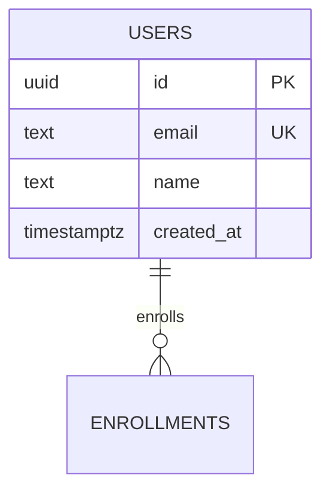

# Archly Schema Mode — Plan

Planning + progress for **Database Schema / ERD** in Archly.  
**Status:** MVP largely implemented · Keep updating as we ship.

---

## 1. Product goal

When a user asks Archly to design a **backend data model**, it should produce a clear ERD:

- Tables as nodes (name + columns with types / PK / FK / unique)
- Relationships as edges (`1:1`, `1:N`, `N:M`) with FK clarity
- AI: natural language → Mermaid `erDiagram` → Schema canvas
- Export: Mermaid ERD + SQL `CREATE TABLE` DDL

This is **separate from Architecture** (services, traffic, chaos).

| Surface | Job |
|---------|-----|
| Architecture (Flow) | Services, edge, storage *as black boxes*, simulation |
| **Schema (new)** | Tables, columns, FKs, cardinality |

---

## 2. Principles

1. **Mermaid `erDiagram` as interchange** — same pattern as flowchart for architecture.
2. **Dedicated Schema canvas** — do not overload architecture `flowNode` with table UI.
3. **AI-first** — “Design Unacademy DB schema” is the primary path; drag-drop is secondary.
4. **Rich templates** — palette ships table templates + multi-table packs (Auth, E-commerce, Edtech, SaaS); packs can **Drop** or **AI expand**.
4. **Clear visuals** — dense but readable table cards; relationship labels on edges.
5. **Export useful artifacts** — `.mmd` + `.sql` minimum.
6. **No chaos/sim in Schema mode** — simulation stays architecture-only.

---

## 3. Architecture

```
┌──────────────────────────────────────────────────────────────┐
│  StudioMode: design | schema | simulate | export             │
│                                                              │
│  Schema mode layout:                                         │
│  ┌─────────────┐  ┌──────────────────┐  ┌─────────────────┐ │
│  │ Schema      │  │ SchemaCanvas     │  │ Right: AI|Table │ │
│  │ palette     │  │ (RF + tableNode) │  │ SchemaAiPanel   │ │
│  └─────────────┘  └──────────────────┘  └─────────────────┘ │
└──────────────────────────┬───────────────────────────────────┘
                           │ SSE  mode=schema
                           ▼
┌──────────────────────────────────────────────────────────────┐
│  POST /v1/ai/text-to-diagram  { prompt, provider, mode }     │
│  mode=schema → erDiagram system prompt                       │
└──────────────────────────────────────────────────────────────┘
```

### Data model (frontend)

```ts
type SchemaColumn = {
  name: string;
  type: string;          // e.g. uuid, text, timestamptz, int
  pk?: boolean;
  fk?: { table: string; column: string } | null;
  unique?: boolean;
  nullable?: boolean;
};

type SchemaTableData = {
  tableName: string;
  columns: SchemaColumn[];
};

// RF node: type "schemaTable"
// RF edge: type "schemaRelation", data: { cardinality, label? }
```

### Persistence

- `DesignKind` includes `"schema"` (TS + API coalesce + migration `007_designs_schema_kind.sql`).
- Elements shape: `{ nodes, edges }` (RF JSON), same as Flow.
- **Still TODO:** full save/hydrate path in `sessions.ts` / History UI labels for schema sessions.

---

## 4. MVP scope (Phase 1)

| # | Item | Status |
|---|------|--------|
| 1 | `schemaplan.md` (this file) | ✅ |
| 2 | `schema.store.ts` + types | ✅ |
| 3 | `SchemaTableNode` + `SchemaRelationEdge` | ✅ |
| 4 | `SchemaCanvas` (RF provider, drop/connect) | ✅ |
| 5 | `erDiagram` → schema converter | ✅ |
| 6 | Backend schema AI prompt + `mode` field | ✅ |
| 7 | Frontend AI Generate in Schema mode | ✅ |
| 8 | StudioMode `"schema"` chrome wiring | ✅ |
| 9 | Export Mermaid ERD + SQL DDL | ✅ |
| 10 | DesignKind `"schema"` migration + API gate | ✅ (hydrate/save UI still light) |
| 11 | Empty Schema hero (chips) | ✅ |
| 12 | Schema palette + table properties editor | ✅ |
| 13 | **Live DB import** — URL → introspect → canvas nodes/edges | ✅ |

### Out of MVP / next

- Full History save/open for `kind: "schema"`
- Migrate apply / Prisma / Drizzle exporters
- Link Architecture “Postgres” node → Schema doc

---

## 5. AI contract

**Request body:** `{ prompt, provider, mode: "schema" }`

**Model must output only:**



**Rules:** production tables, FK as line + column, 12–25 entities, no flowchart.

---

## 6. File map (shipped)

```
schemaplan.md

archly-frontend/
  src/types/schema.ts
  src/store/schema.store.ts
  src/lib/schema/er-to-schema.ts
  src/lib/schema/schema-to-sql.ts      # + schemaToMermaid
  src/lib/schema/schema-to-mermaid.ts  # re-export
  src/components/schema/SchemaCanvas.tsx
  src/components/schema/SchemaTableNode.tsx
  src/components/schema/SchemaRelationEdge.tsx
  src/components/schema/SchemaPalette.tsx
  src/components/schema/SchemaEmptyHero.tsx
  src/components/schema/SchemaAiPanel.tsx
  src/components/schema/SchemaPropertiesPanel.tsx
  src/components/studio/StudioModeBar.tsx   # + Schema mode
  src/hooks/useAiStream.ts                 # mode param
  src/app/(canvas)/canvas/page.tsx         # wired

archly-backend/
  internal/services/ai.service.go          # schemaSystemPrompt + mode
  internal/handlers/ai.go                  # mode JSON field
  internal/services/design.service.go      # kind schema allowed
  internal/db/migrations/007_designs_schema_kind.sql
```

---

## 7. How to try it

1. Open studio → click **Schema** in the mode bar
2. Use empty-state chips (Unacademy / Stripe / Uber / SaaS) or type a prompt
3. Tables + relationships appear on the canvas
4. Click a table → edit columns in the right **Table** tab
5. **Export** → erDiagram `.mmd` and SQL `.sql`
6. ⌘K → “Switch to Schema” / “Generate database schema”

Rebuild API after pulling so `mode=schema` is live:
`docker compose up -d --build api` (or local `make run`).

### Ollama Modelfiles (same pattern as architecture)

```bash
cd archly-backend
ollama create archly-architect -f archly-architect.Modelfile
ollama create archly-schema    -f archly-schema.Modelfile
```

| Mode | Model | Env |
|------|-------|-----|
| Architecture | `archly-architect` | `OLLAMA_MODEL` |
| Schema | `archly-schema` | `OLLAMA_SCHEMA_MODEL` |

Ollama calls send an **empty system** so the Modelfile few-shots stay active. Cloud providers use the mirrored prompts in `ai.service.go`.

Apply migration when ready:
`goose … up` (migration `007_designs_schema_kind.sql`).

---

## 8. Progress log

| Date | Note |
|------|------|
| 2026-07-27 | Plan created. |
| 2026-07-27 | MVP implemented: Schema mode, store, nodes, er converter, AI mode=schema, export MMD/SQL, empty hero, table editor, DesignKind+migration. |
| 2026-07-27 | `archly-schema.Modelfile` (few-shot erDiagram) + `OLLAMA_SCHEMA_MODEL`; Architecture-for-this prompts match Modelfile user phrasing. |
| 2026-07-28 | Live DB import: `POST /v1/schema/introspect`, Schema palette + empty hero UI (postgres/mysql/mongodb/sqlite → RF graph). |
| 2026-07-28 | DB import v2: list databases/tables, partial collection picker, re-import diff, Prisma/SQL/Mongo migrate export, AI explain table/schema, architecture-from-schema button. |

---

## 10. Live DB import (v2)

### API

| Endpoint | Purpose |
|----------|---------|
| `POST /v1/schema/databases` | List databases (Mongo/Postgres/MySQL) |
| `POST /v1/schema/tables` | List tables/collections (no sampling) |
| `POST /v1/schema/introspect` | `{ url, database?, schema?, tables?[] }` → RF graph |

### UX flow

1. Paste connection URL → **Connect** → pick database
2. **Load tables** → checkbox picker (partial import for large Atlas DBs)
3. **Import** → canvas + baseline snapshot for drift
4. **Re-import & diff** → highlights added/removed/changed tables (border + badge)
5. **Explain this table (AI)** in properties panel — purpose, columns, connections
6. **Explain entire schema (AI)** + **Architecture for this schema** in AI panel
7. **Export** → SQL, Prisma, MongoDB migration script (`migrate-mongo.js`)

### Files

```
archly-backend/internal/schema/list_tables.go
archly-frontend/src/lib/schema/schema-diff.ts
archly-frontend/src/lib/schema/schema-to-prisma.ts
archly-frontend/src/lib/schema/schema-to-mongo-migrate.ts
archly-frontend/src/lib/schema/schema-explain.ts
archly-frontend/src/hooks/useSchemaExplain.ts
```

---

## 9. Acceptance criteria (MVP)

- [x] User can switch to Schema mode
- [x] Empty state: prompt chips generate an ERD onto canvas
- [x] Tables show columns with PK/FK markers
- [x] Relationship edges show cardinality
- [x] Export downloads `.mmd` and `.sql`
- [x] Import live database via URL (Schema mode)
- [x] Architecture Flow unchanged (isolated store)
- [ ] Save/History fully understands schema sessions (next)
